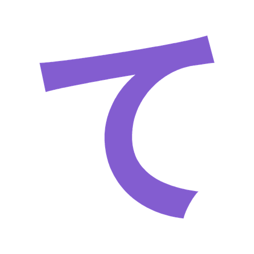

# Tegaki

**Tegaki** is a personal fork of [Komikku](https://github.com/komikku-app/komikku), a free and open-source manga reader for Android — which is itself based on [Mihon](https://github.com/mihonapp/mihon) and [TachiyomiSY](https://github.com/jobobby04/TachiyomiSY).

It only exists to add a couple of personal features on top of Komikku. **It is not affiliated with or endorsed by the Komikku project.** For the official app, releases, documentation, and support, please go to [komikku-app/komikku](https://github.com/komikku-app/komikku).

> **Note:** The added features in this fork were implemented with AI assistance (Claude Code).

*Requires Android 8.0 or higher.*

## Added features

Everything Komikku already does, plus:

- **Priority-based scanlator filter** — set a per-manga priority order for scanlators so duplicate chapters are deduplicated down to your preferred scanlator's release; scanlators can also be hidden entirely. (Replaces the previous exclude-only system.)
- **Migration → "Hide entries behind current source"** — when migrating between sources, automatically hides candidate matches whose latest chapter is behind your current source, keeping only equal-or-ahead matches.
- **In-app WebView ad-blocker** — blocks ad/tracker requests, popunders, and redirects in the built-in WebView (using the HaGeZi Pro++ blocklist), so browsing ad-heavy source sites is far cleaner. (Network-level blocking; no cosmetic element-hiding.)

For the full base feature set, see the [upstream Komikku README](https://github.com/komikku-app/komikku#readme).

## Credits

All credit for the base app goes to the authors and contributors of
[Komikku](https://github.com/komikku-app/komikku),
[TachiyomiSY](https://github.com/jobobby04/TachiyomiSY),
and [Mihon](https://github.com/mihonapp/mihon).

## Disclaimer

The developers of this application do not have any affiliation with the content providers available, and this application hosts zero content.

## License

    Copyright 2015 Javier Tomás

    Licensed under the Apache License, Version 2.0 (the "License");
    you may not use this file except in compliance with the License.
    You may obtain a copy of the License at

    http://www.apache.org/licenses/LICENSE-2.0

    Unless required by applicable law or agreed to in writing, software
    distributed under the License is distributed on an "AS IS" BASIS,
    WITHOUT WARRANTIES OR CONDITIONS OF ANY KIND, either express or implied.
    See the License for the specific language governing permissions and
    limitations under the License.
